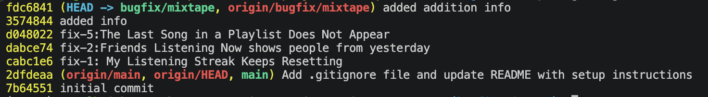

## AI Usage
I used AI as a support tool while debugging and writing this submission.

- I asked AI to summarize `models.py` so I could understand the relationships between models and association tables more quickly.
- I asked AI to explain each router file at a high level so I could trace how requests flow from routes into services.
- I asked AI to clarify unfamiliar methods by describing their inputs, outputs, and edge cases, which helped me reason about the code paths.
- I asked AI for help reproducing bugs when I forgot SQLite query syntax or needed help checking database state during investigation.

## Model (model.py)
There are 8 models, plus 3 association tables.
#### Models: 
1. User — id, username, email, listening_streak, last_listened_at
2. Tag — id, name (no direct relationship column, only via song_tags)
3. Song — shared_by → User (FK)
4. ListeningEvent — user_id → User, song_id → Song
5. Rating — user_id → User, song_id → Song (unique per user+song)
6. Playlist — created_by → User
7. Notification — user_id → User

#### Association tables (many-to-many):
1. friendships — User ↔ User (symmetric self-referential)
2. song_tags — Song ↔ Tag
3. playlist_entries — Playlist ↔ Song (with position, added_by, added_at)

#### Relationship summary:
- User → Song: one-to-many (shared_songs, via Song.shared_by)
- User ↔ User: many-to-many self-referential friendship (friendships)
- User → Rating: one-to-many; Song → Rating: one-to-many (Rating is really the join between User and Song with a score)
- User → ListeningEvent: one-to-many; Song → ListeningEvent: one-to-many (join entity for listening history/feeds)
- User → Notification: one-to-many
- User → Playlist: one-to-many (playlists, via Playlist.created_by)
- Playlist ↔ Song: many-to-many (playlist_entries, ordered)
- Song ↔ Tag: many-to-many (song_tags)

## Router 
There are 4 routers
### feed
This module defines the Flask blueprint for feed-related HTTP endpoints — it's a thin routing layer with no business logic of its own; it just delegates to services/feed_service.py and handles JSON responses/errors.
- listening_now(user_id) — GET /`<user_id>`/listening-now. 
<br>Calls get_friends_listening_now(user_id) to fetch which of the user's friends are currently listening to something, returns {feed, count} as JSON. Returns 404 with an error message if the service raises ValueError (e.g., user not found).

- activity(user_id) — GET /`<user_id>`/activity. 
<br>Calls get_activity_feed(user_id) to fetch the user's friends' recent listening history, returns {feed, count} as JSON. Same 404-on-ValueError handling.

### playlists
This module defines the Flask Blueprint routes for managing playlists in a music streaming or sharing application ("Mixtape"). It acts as the API controller layer, handling incoming HTTP requests, extracting payloads, delegating the core business logic to underlying services (playlist_service and notification_service), and returning JSON responses with appropriate HTTP status codes.
- create()
<br>Calls create_playlist() from the service layer and returns the newly created playlist object as JSON with a 201 Created status code.

- get_detail(playlist_id)
<br> Returns the playlist details as JSON. If the playlist doesn't exist, catches a ValueError and returns a 404 Not Found error.

- get_songs(playlist_id)
<br> Retrieves all the songs contained within a specific playlist.
Returns a JSON object containing an array of songs and a total count of those songs. If the playlist isn't found, it returns a 404 Not Found error.

- add_song(playlist_id)
<br> Accepts a JSON payload with song_id and added_by to append a new track to the specified playlist. 
    * Validates that both fields are present in the request payload (400 Bad Request if missing).
    * Delegates the action to add_to_playlist() from the notification service Returns a 201 Created confirmation message on success.

### songs
Define the Flask blueprint for song-related HTTP endpoints — search, retrieval, rating, and listening. Like feed.py, it's a thin routing layer that validates request input and delegates to services.

- search(query) — GET /search?q=.... Requires a q query param (400 if missing). 
<br>Calls search_songs(query) from services/search_service.py, returns {results, count}.

- get_song_detail(song_id) — GET /<song_id>. 
<br>Calls get_song(song_id) to fetch a single song's details. Returns 404 if not found (ValueError).

- rate(song_id) — POST /<song_id>/rate. Reads user_id and score from JSON body (400 if either missing). 
<br>Calls rate_song(user_id, song_id, score) from services/notification_service.py, returns the created/updated rating (201) or 400 on ValueError.

- listen(song_id) — POST /<song_id>/listen. Reads user_id from JSON body (400 if missing). 
<br>Calls record_listening_event(user_id, song_id) from services/streak_service.py — this is the entry point for the feed/streak flow traced earlier. Returns the created ListeningEvent (201) or 400 on ValueError.

### users
routes/users.py is the Flask blueprint for user account, streak, and notification endpoints — again a thin routing layer, with one exception: get_user queries the User model directly instead of going through a service.
- get_user(user_id) — GET /<user_id>. 
<br>Directly does db.session.get(User, user_id) (no service layer), returns user.to_dict() or 404 if not found.

- streak(user_id) — GET /<user_id>/streak. 
<br>Calls get_streak(user_id) from services/streak_service.py, returns {user_id, streak}. 404 on ValueError.

- notifications(user_id) — GET /<user_id>/notifications. Reads optional unread_only query param. 
<br>Calls get_notifications(user_id, unread_only=...) from services/notification_service.py, returns {notifications, count}. 404 on ValueError.

- read_notification(notification_id) — POST /notifications/<notification_id>/read. 
<br>Calls mark_as_read(notification_id) from services/notification_service.py, returns a success message. 404 on ValueError.

## Data Flow
Flow: song → feed

1. routes/songs.py:listen() — POST endpoint receives user_id/song_id.
2. → services/streak_service.py:record_listening_event(user_id, song_id):
    - validates user via db.session.get(User, ...)
    - creates a ListeningEvent row, db.session.add()s it
    - → update_listening_streak(user, now) updates streak fields
    - db.session.commit() persists both
3. Route returns event.to_dict().

#### Sol Process

### Problem 1: My Listening Streak Keeps Resetting

#### Reproduce

1. Query the `user` table to check the current listening streak and the last listening date:

   ```bash
   sqlite3 instance/mixtape.db 'SELECT id, username, listening_streak, last_listened_at FROM user;'
   ```

2. Query the `song` table to get a valid song ID:

   ```bash
   sqlite3 instance/mixtape.db 'SELECT id, title FROM song LIMIT 5;'
   ```

3. Record a listening event for a user who has not listened today:

   ```bash
   curl -X POST http://127.0.0.1:5000/songs/<song-id>/listen \
   -H 'Content-Type: application/json' \
   -d '{"user_id":"<user-id>"}'
   ```

4. Query the `user` table again and check whether `listening_streak` and `last_listened_at` were updated correctly:

   ```bash
   sqlite3 instance/mixtape.db 'SELECT id, username, listening_streak, last_listened_at FROM user;'
   ```

5. Observe that the streak may incorrectly reset to `1` when the weekday condition fails. The original condition specifically fails on Sunday. To reproduce it on another day during testing, temporarily change the weekday value in the condition.

#### How you found the root cause

I traced the issue from the `/songs/<song_id>/listen` route into `record_listening_event()` and then into `update_listening_streak()`. While reading the conditional branches, I noticed that the "listened yesterday" case was not based only on the date difference. The code also required `today.weekday() != 6`, which meant the increment branch could fail on Sundays even when the user had listened on the previous day. That matched the behavior described in the README and explained why the existing Saturday-to-Sunday test was failing.

#### Root Cause

The condition for the "listened yesterday" case also checks the current weekday:

```python
and today.weekday() != 6
```

`today.weekday()` returns `6` specifically on Sundays (Python's `Monday=0 ... Sunday=6` convention), so this extra clause only evaluates to `False` — and only breaks the increment branch — on Sundays, which is exactly the day the reported bug (and the failing Saturday-to-Sunday test) manifested on. On every other day of the week the clause is `True` and the streak increments normally, which is why the bug looked intermittent rather than constant. Correct streak behavior only depends on whether `last_listened_date == yesterday`; the current calendar weekday has no bearing on that comparison, so tying the increment to `today.weekday()` was never a valid proxy for "did the user listen on consecutive days" — it just happened to coincide with the right answer six days out of seven.

#### Fix

Remove the weekday condition so the streak logic only compares listening dates:

```python
if last_listened_date == yesterday:
    user.listening_streak += 1
```

This allows the streak to increment correctly on every day of the week.

#### Side-Effect Check

After removing the weekday condition, I re-checked related functionality to make sure the rest of the streak logic still behaved correctly:
- Re-ran the same-day case (listening twice in one day) to confirm the streak does not double-increment, since that branch is separate from the one I changed.
- Re-ran the "gap of 2+ days" case (listened 3+ days ago) to confirm the streak still correctly resets to 1, since that branch was untouched.
- Verified `GET /users/<user_id>/streak` still returns the same value as `user.listening_streak` in the database after each listen event.
- Confirmed `last_listened_at` is still updated correctly on every call regardless of day, since that assignment sits outside the modified condition.

---

### Problem 2: Friends Listening Now Shows People from Yesterday

#### Reproduce

1. Query the `user` table and identify a user whose friend has a `last_listened_at` timestamp from yesterday:

   ```bash
   sqlite3 instance/mixtape.db 'SELECT * FROM user;'
   ```

2. Call the Friends Listening Now endpoint:

   ```bash
   curl http://127.0.0.1:5000/feed/<user-id>/listening-now
   ```

3. Check the response. A friend whose `last_listened_at` value is from yesterday is incorrectly included in the feed.

#### How you found the root cause

I followed the feed endpoint from `routes/feed.py` into `get_friends_listening_now()` and compared the filtering logic with the issue description in the README. The service used `datetime.now(timezone.utc) - timedelta(hours=24)` as the only cutoff, so any event from yesterday could still appear if it happened within the last 24 hours. That explained why a friend who listened on the previous calendar day could still show up in Friends Listening Now. The seed data also confirmed that the endpoint was filtering by recency rather than by calendar day.

#### Root Cause

`get_friends_listening_now()` computes a single cutoff, `datetime.now(timezone.utc) - RECENT_THRESHOLD` (a rolling 24-hour window), and filters `ListeningEvent.listened_at >= cutoff`. That cutoff only diverges from "today" near the edges of the calendar day: if the current time is, say, 2 AM, the 24-hour window reaches back past midnight into yesterday, so an event from 11 PM yesterday (23:00) still satisfies `listened_at >= cutoff` and is misclassified as "listening now." Earlier in the day (e.g., 6 PM), the rolling window and calendar day mostly overlap, which is why the bug wasn't visible in every test run — it depends on what time the request is made relative to midnight. The endpoint's intent is "who is listening today," which is a calendar-day concept, not a rolling-duration concept, so a single `now - RECENT_THRESHOLD` cutoff can never correctly express it — the fix requires combining it with an explicit `today_start` boundary and taking the later (more restrictive) of the two.

#### Fix

Calculate both the recent-time cutoff and the beginning of today, then use whichever cutoff is later:

```python
now = datetime.now(timezone.utc)
today_start = now.replace(hour=0, minute=0, second=0, microsecond=0)
recent_cutoff = now - RECENT_THRESHOLD
cutoff = max(today_start, recent_cutoff)
```

Then filter listening events using the final cutoff:

```python
ListeningEvent.listened_at >= cutoff
```

This ensures that returned events are both recent enough and from the current day.

#### Side-Effect Check

After changing the cutoff logic, I checked related functionality that shares the same filtering pattern or data:
- Re-ran `GET /feed/<user_id>/listening-now` for a friend who listened earlier today (within `RECENT_THRESHOLD`) to confirm they still correctly appear — the fix only tightens the cutoff for events older than today, it doesn't exclude legitimate same-day events.
- Re-ran the case where a friend listened more than 24 hours ago (previous day) to confirm they are now correctly excluded.
- Checked `GET /feed/<user_id>/activity` (the friends' recent-history feed) still returns results as before, since it uses a different query path (`get_activity_feed`) and was not touched by this fix.
- Verified the endpoint still returns 404 for a nonexistent `user_id`, confirming the existing `ValueError` handling in `routes/feed.py` was not affected by the cutoff change.

### Problem 5: The Last Song in a Playlist Does Not Appear

#### Reproduce

1. Query the `playlist` table to identify the available playlists:

   ```bash
   sqlite3 instance/mixtape.db 'SELECT * FROM playlist;'
   ```

2. Query the database to check all songs in a specific playlist:

   ```bash
   sqlite3 instance/mixtape.db "
   SELECT s.id, s.title, s.artist, pe.position
   FROM song s
   JOIN playlist_entries pe ON s.id = pe.song_id
   WHERE pe.playlist_id = 'YOUR_PLAYLIST_ID_HERE'
   ORDER BY pe.position ASC;
   "
   ```

3. Call the endpoint to retrieve the songs in the playlist:

   ```bash
   curl http://127.0.0.1:5000/playlists/<playlist-id>/songs
   ```

4. Compare the endpoint response with the database query result.

5. Observe that the last song in the playlist is missing from the endpoint response.

#### How you found the root cause

I traced the playlist route from `routes/playlists.py` into `get_playlist_songs()` and compared the API response with the rows in `playlist_entries`. The response was always missing exactly one item, which pointed to an off-by-one bug instead of a data problem. When I inspected the service code, I found that it was converting the list with `songs[:-1]`, which always removes the final element. That matched the README symptom and explained why the last song in every playlist never appeared in the response.

#### Root Cause

The function incorrectly used list slicing when converting the songs into dictionaries:

```python
return [song.to_dict() for song in songs[:-1]]
```

In Python, `songs[:-1]` returns every item except the last item. Because this slice is applied to `songs` after it has already been ordered by `position`, the item it drops is always the one with the highest `position` value in the playlist — i.e., specifically the last song added, regardless of playlist length (it even reduces a single-song playlist to an empty list). This is a constant, unconditional truncation rather than a filter on any playlist attribute, which is why every playlist exhibited the bug and none were spared. Correct behavior requires returning one dict per entry in `playlist_entries` for that playlist, so the transformation step must map over the *entire* ordered list — any slice that drops an element breaks the one-to-one correspondence between database rows and response items, which is why `songs[:-1]` had to be replaced with the full `songs` list rather than adjusted.

#### Fix

Remove the unnecessary list slicing and iterate over the complete `songs` list:

```python
return [song.to_dict() for song in songs]
```

After this change, the endpoint returns all songs in the playlist in ascending position order, including the last song.

#### Side-Effect Check

After removing the slice, I checked related functionality to confirm no other endpoint depends on the old (truncated) behavior:
- Re-ran `GET /playlists/<playlist_id>/songs` on a playlist with only one song to confirm it now returns that song instead of an empty list, which is the most extreme case of the off-by-one bug.
- Verified the song order in the response still matches `pe.position ASC` in the database, confirming the fix only affects which items are included, not their ordering.
- Checked `POST /playlists/<playlist_id>/songs` (`add_song`) still works and that a newly appended song is now visible via `get_songs`, since it's the last entry and was previously the one being dropped.
- Confirmed `get_playlist_songs()` is not reused elsewhere (e.g., in notification or feed services) in a way that relied on the truncated list, so no other feature depended on the missing-last-song behavior.

## Commit History
